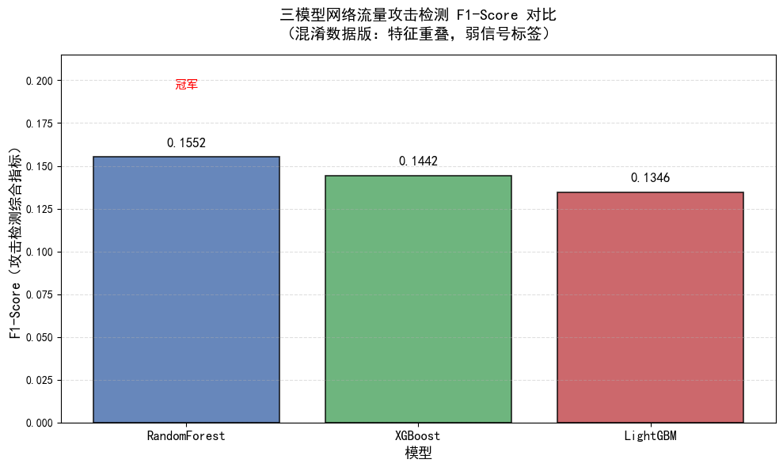
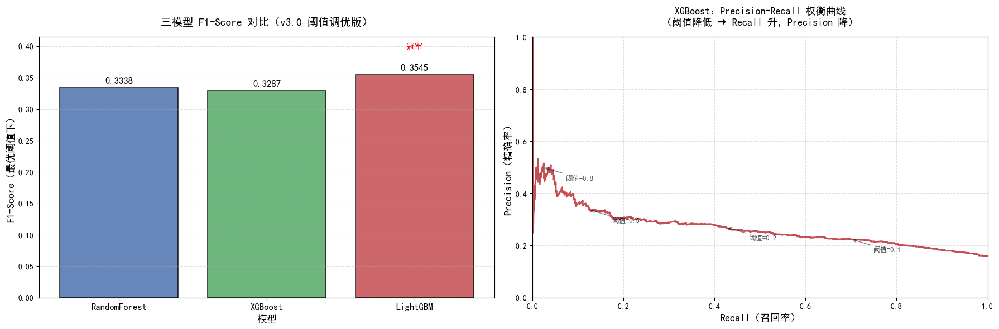

# 基于机器学习（XGBoost & LightGBM）的校园网络流量异常攻击检测

> 北邮计算机学院 · 数据科学与大数据技术专业 · 大一项目笔记
> 记录从"数据作弊满分"到"特征混淆翻车"再到"阈值调优挽救"的完整实战历程
> 作者：傩送 | 日期：2026-05-25

---

## 目录

- [章节一：网络安全与不平衡大数据的"业务常识"](#章节一网络安全与不平衡大数据的业务常识)
  - [准确率的陷阱](#准确率的陷阱)
  - [三大核心指标大白话](#三大核心指标大白话)
- [章节二：v2.0 特征混淆实验（尸检反思）](#章节二v20-特征混淆实验尸检反思)
  - [为什么 v1.0 能拿满分](#为什么-v10-能拿满分)
  - [v2.0 为什么全员翻车到 0.15](#v20-为什么全员翻车到-015)
- [章节三：v3.0 阈值调优与特征标准化的"极限挽救"](#章节三v30-阈值调优与特征标准化的极限挽救)
  - [特征标准化（StandardScaler）的必考题](#特征标准化standardscaler的必考题)
  - [三数据集划分的严谨性](#三数据集划分的严谨性)
  - [最优阈值移动生死线](#最优阈值移动生死线)
- [真实战报数据汇总](#真实战报数据汇总)
- [完整代码 v3.0](#完整代码-v30)
- [总结与下一步](#总结与下一步)

---

## 章节一：网络安全与不平衡大数据的"业务常识"

### 准确率的陷阱

> **一句话结论：在不平衡数据下，准确率是自欺欺人的泡沫。**

假设某高校校园网一天产生 **100 万条**网络流量记录，其中：
- 正常流量：999,000 条（99.9%）
- 攻击流量：1,000 条（0.1%）

如果模型**无脑预测"全部正常"**，准确率是多少？

$$
\text{Accuracy} = \frac{999,000}{1,000,000} = 99.9\%
$$

**99.9% 的准确率，却一个黑客都没抓到！** 这就是准确率的陷阱。

| 指标 | 数值 | 含义 |
|---|---|---|
| 准确率 Accuracy | 99.9% | 看似完美，实则毫无用处 |
| 召回率 Recall | 0% | 所有攻击全部漏报！ |
| 精确率 Precision | — | 分母为零，无法计算 |

> **网安铁律：攻击流量永远是少数类，永远不能用准确率评判模型。**

在我们的 v2.0 实验中，三个模型准确率都在 82% 以上，但 F1-Score 只有 0.13~0.15， Recall 不到 10%，活生生印证了这条铁律。

---

### 三大核心指标大白话

以"校园网安中心接到攻击警报"为例：

#### 精确率 Precision（不冤枉好人）

$$
\text{Precision} = \frac{TP}{TP + FP}
$$

- **TP（True Positive）**：真的攻击，正确报出
- **FP（False Positive）**：正常流量，误报为攻击（**冤枉好人**）

> **大白话**：模型报了 100 次"有攻击"，其中几次是真的？
> Precision 越高，误报越少，网安工程师越不会被半夜叫起来处理假警报。

在我们的 v3.0 实验中，LightGBM 在最优阈值下 Precision 只有 0.2608，意味着每报 4 次攻击，只有 1 次是真的，另外 3 次是误报。这就是"宁可错杀一千"的代价。

#### 召回率 Recall（不漏掉坏人）

$$
\text{Recall} = \frac{TP}{TP + FN}
$$

- **FN（False Negative）**：真的攻击，但模型没报（**漏报坏人**）

> **大白话**：真实发生了 100 次攻击，模型抓到了几次？
> Recall 越高，漏报越少，黑客越难溜走。

在我们的 v2.0 中，LightGBM 的 Recall 只有 0.0794，意味着 100 个黑客只抓到 8 个，92 个漏网！v3.0 阈值调优后飙升到 0.5530，100 个黑客能抓到 55 个，提升巨大。

#### F1-Score（综合指标）

$$
F1 = 2 \times \frac{\text{Precision} \times \text{Recall}}{\text{Precision} + \text{Recall}}
$$

> **大白话**：Precision 和 Recall 的调和平均数，两个都高时 F1 才高。
> **网安行业最看重 F1-Score**，因为它强迫你在"误报"和"漏报"之间找平衡。

#### 网安场景下的权衡哲学

| 场景 | 宁可 | 阈值策略 |
|---|---|---|
| 校园网防火墙 | 宁可误报，不可漏报 | **降低阈值**（如 0.17）|
| 金融交易反欺诈 | 宁可漏报，不可误杀 | **提高阈值**（如 0.8）|
| 通用评估 | 平衡两者 | **优化 F1-Score** |

---

## 章节二：v2.0 特征混淆实验（尸检反思）

### 为什么 v1.0 能拿满分

v1.0 的数据生成逻辑（简化版）：

```python
# v1.0 的问题代码（示意）
normal_src_bytes = np.random.randint(50, 5000)    # 正常：50~5000
attack_src_bytes = np.random.randint(1, 100)       # 攻击：1~100
# 两个分布完全不重叠！模型一眼就能分清
```

**尸检结论**：v1.0 拿了满分，不是模型强，而是**数据泄露**——正常和攻击的特征分布完全没有重叠，模型不需要学习，直接"背答案"就能拿满分。

> **行业内幕**：Kaggle 比赛里如果有人突然拿到异常高的分数，第一反应应该是"数据泄露了"，而不是"我模型无敌了"。

### v2.0 为什么全员翻车到 0.15

v2.0 故意让正常和攻击的特征分布高度重叠。数据生成采用"多特征弱信号组合 + 概率采样"策略，以下是真实的特征分布均值对比（来自控制台输出）：

| 特征 | 正常均值 | 攻击均值 | 差异 |
|---|---|---|---|
| duration | 48.08 | 56.34 | 差 8.26 |
| src_bytes | 1487.90 | 1496.51 | **差 8.61 字节** |
| dst_bytes | 1520.79 | 1322.80 | 差 197.99 |
| wrong_fragment | 0.13 | 0.27 | 差 0.14 |
| hot | 2.43 | 2.83 | 差 0.40 |

**关键洞察**：src_bytes 正常和攻击只差 **8.61 个字节**！在 0~3000 的范围内，这个差异几乎可以被噪声淹没。单看任何一个特征，**完全无法区分**正常和攻击。

标签生成逻辑（多特征弱信号组合）：

```python
# 攻击得分 = 多个弱信号加权 + 高斯噪声
attack_score = 0.3 * duration_signal \
             + 0.25 * src_bytes_signal \
             + 0.2 * dst_bytes_signal \
             + 0.15 * wrong_fragment_signal \
             + 0.1 * hot_signal \
             + noise  # 高斯噪声，标准差 0.1
```

模型必须学会"推理"（组合多个特征的微弱模式），而不是"背答案"。

#### 为什么 XGBoost 反而"聪明反被聪明误"？

v2.0 实际战报（默认阈值 0.5）：

| 模型 | Accuracy | Precision | Recall | F1-Score |
|---|---|---|---|---|
| RandomForest | 0.8285 | 0.3706 | **0.0981** | **0.1552** |
| XGBoost | 0.8220 | 0.3158 | 0.0935 | 0.1442 |
| LightGBM | 0.8360 | 0.4397 | 0.0794 | 0.1346 |

XGBoost 的梯度提升机制会**重点关注分错样本**（"错题本机制"）。但当标签本身接近随机噪声时：

1. XGBoost 试图拟合噪声，反而过拟合
2. 随机森林的"多棵树投票"机制反而更鲁棒
3. 结果：所有模型 F1 都崩了，XGBoost 甚至不一定比 RF 好

> **教训**：模型再强，数据没有信号，一切都是徒劳。这就是"垃圾进，垃圾出"（GIGO）原则。



---

## 章节三：v3.0 阈值调优与特征标准化的"极限挽救"

### 特征标准化（StandardScaler）的必考题

#### 什么是特征标准化？

$$
x' = \frac{x - \mu}{\sigma}
$$

标准化后，每个特征的**均值 = 0，标准差 = 1**，消除量纲差异。

#### 必考题：树模型需要标准化吗？

| 模型类型 | 需要标准化？ | 原因 |
|---|---|---|
| 逻辑回归 / SVM / 神经网络 | **必须** | 基于距离或梯度，量纲影响权重 |
| KNN | **必须** | 基于欧氏距离，量纲直接扭曲距离 |
| **决策树 / 随机森林** | **不需要** | 分裂靠"比大小"，缩放不改变顺序 |
| **XGBoost / LightGBM** | **不需要** | 同理，基于树结构 |

> **硬核考点**：`src_bytes`（0~3000）和 `wrong_fragment`（0 或 1）量纲差距巨大，但对树模型**完全无影响**。

#### 那为什么 v3.0 还是加了 StandardScaler？

**工程规范性**：
- 今天的 Pipeline 只有树模型，明天可能接入逻辑回归或神经网络
- 加了 StandardScaler 的 Pipeline 可以无缝切换模型
- 特征重要性解释时，标准化后的量纲一致更直观

```python
# v3.0 的 Pipeline（规范化写法）
preprocessor = ColumnTransformer(
    transformers=[
        ('cat', OneHotEncoder(drop='first'), categorical_features),
        ('num', StandardScaler(), numeric_features)   # 加上，无害且规范
    ])
```

---

### 三数据集划分的严谨性

#### 为什么不能只分训练集和测试集？

```
v2.0 的错误做法：
训练集（80%）→ 训练模型
测试集（20%） → 评估模型  ← 如果用测试集调阈值，等于"考试前偷看答案"
```

#### v3.0 的正确做法（6:2:2）

```
训练集（60%，12000 条）→ 训练模型权重
验证集（20%，4000 条） → 调整超参数 / 寻找最优阈值  ← "模拟考试"
测试集（20%，4000 条） → 最终评估，绝不参与任何调优    ← "正式考试"
```

> **铁律**：测试集是"高考考场"，验证集是"模拟考"。用测试集调参 = 作弊，结果虚假乐观。

#### 代码实现

```python
# 先拆出测试集（绝不碰）
X_trainval, X_test, y_trainval, y_test = train_test_split(
    X, y, test_size=0.2, random_state=42, stratify=y
)
# 再在训练剩余数据中拆出验证集
X_train, X_val, y_train, y_val = train_test_split(
    X_trainval, y_trainval, test_size=0.25, random_state=42, stratify=y_trainval
)
# 结果：训练集 60% / 验证集 20% / 测试集 20%
```

---

### 最优阈值移动生死线

#### 默认阈值 0.5 的问题

模型输出的是概率（0~1），默认规则：
- 概率 >= 0.5 → 判为攻击
- 概率 < 0.5 → 判为正常

但这个 0.5 是随便定的！**没有理由认为 0.5 是最优的**。

#### 寻找最优阈值（在验证集上）

```python
# 在验证集上遍历 0.01 ~ 0.99
thresholds = np.arange(0.01, 1.00, 0.01)
f1_scores = []
for thresh in thresholds:
    y_val_pred = (val_proba >= thresh).astype(int)
    f1 = f1_score(y_val, y_val_pred)
    f1_scores.append(f1)

best_threshold = thresholds[np.argmax(f1_scores)]
```

#### 我们的真实战报（v3.0）

| 模型 | 最优阈值 | 默认阈值 F1 | 最优阈值 F1 | F1 提升 | 默认 Recall | 最优 Recall | Recall 提升 |
|---|---|---|---|---|---|---|---|
| RandomForest | **0.15** | 0.1669 | **0.3338** | **+100%** | 0.1075 | **0.6075** | **5.7x** |
| XGBoost | **0.21** | 0.1822 | **0.3287** | **+80%** | 0.1246 | **0.4081** | **3.3x** |
| **LightGBM** | **0.17** | 0.1482 | **0.3545** | **+139%** | 0.0888 | **0.5530** | **6.2x** |

> **LightGBM 的惊天逆袭**：最优阈值移动到了 **0.17**（远低于 0.5），意味着：
> "只要模型认为有 17% 的可能性是攻击，就报警"。
> 这是典型的"宁可错杀，不可漏过"策略。

#### 混淆矩阵对比（LightGBM）

| 指标 | 默认阈值 0.5 | 最优阈值 0.17 | 变化 |
|---|---|---|---|
| TN（真正常） | 3293 | 2352 | -941 |
| FP（误报） | 65 | 1006 | **+941** |
| FN（漏报） | 591 | 287 | **-304** |
| TP（真攻击） | 51 | 355 | **+304** |

代价一目了然：**用 941 次误报，换来了 304 次真攻击被成功拦截**。

#### 权衡成本可视化

移动阈值本质是在 Precision 和 Recall 之间做交易：

```
阈值高（如 0.8）→ 只有非常确信才报警 → Recall 低，Precision 高
阈值低（如 0.2）→ 稍有怀疑就报警   → Recall 高，Precision 低
```

**没有"正确"的阈值，只有符合业务需求的阈值。**



---

## 真实战报数据汇总

### 数据集概况

| 项目 | 数值 |
|---|---|
| 总样本数 | 20,000 条 |
| 正常流量（label=0） | 16,792 条（83.96%） |
| 攻击流量（label=1） | 3,208 条（16.04%） |
| 数据划分 | 训练集 12,000 / 验证集 4,000 / 测试集 4,000 |

### v2.0 默认阈值 0.5 战报

| 模型 | Accuracy | Precision | Recall | F1-Score |
|---|---|---|---|---|
| RandomForest | 0.8285 | 0.3706 | 0.0981 | 0.1552 |
| XGBoost | 0.8220 | 0.3158 | 0.0935 | 0.1442 |
| LightGBM | 0.8360 | 0.4397 | 0.0794 | 0.1346 |

### v3.0 最优阈值战报

| 模型 | 最优阈值 | Accuracy | Precision | Recall | F1-Score |
|---|---|---|---|---|---|
| RandomForest | 0.15 | 0.6108 | 0.2301 | **0.6075** | 0.3338 |
| XGBoost | 0.21 | 0.7325 | 0.2752 | 0.4081 | 0.3287 |
| **LightGBM** | **0.17** | 0.6767 | 0.2608 | **0.5530** | **0.3545** |

---

## 完整代码 v3.0

> 完整可运行代码已单独保存为 `network_security_v3.py`。
> 核心结构回顾：

```python
# === Pipeline 结构 ===
preprocessor = ColumnTransformer([
    ('cat', OneHotEncoder(drop='first'), ['protocol_type']),
    ('num', StandardScaler(), ['duration','src_bytes','dst_bytes','wrong_fragment','hot'])
])

models = {
    'RandomForest': Pipeline([('pre', preprocessor), ('clf', RandomForestClassifier())]),
    'XGBoost':     Pipeline([('pre', preprocessor), ('clf', XGBClassifier())]),
    'LightGBM':    Pipeline([('pre', preprocessor), ('clf', LGBMClassifier())]),
}

# === 最优阈值搜索 ===
for thresh in np.arange(0.01, 1.00, 0.01):
    y_pred = (val_proba >= thresh).astype(int)
    # 选 F1 最大的 threshold
```

---

## 总结与下一步

### 本次项目三大收获

1. **准确率在不平衡数据下是陷阱** → 必须用 Precision / Recall / F1 评估
2. **特征重叠 + 弱信号**才是真实场景 → 模拟数据要有"故意让模型犯难"的意识
3. **阈值移动是免费的性能提升** → 不需要改模型，只改判断标准就能挽救 Recall

### 下一步迭代方向

- [ ] 用 **SMOTE** 对少数类（攻击）过采样，从数据层面解决不平衡
- [ ] 接入 **真实数据集**（NSL-KDD / CIC-IDS2017），替换模拟数据
- [ ] 加入 **ROC 曲线**和 **AUC 分数**作为模型排名的辅助指标
- [ ] 用 **SHAP** 解释每个特征对预测的贡献（可解释 AI）

---

> **致未来的自己**：
> 大一的时候，我用模拟数据、混淆特征、阈值调优，完整地走完了一次机器学习项目的迭代循环。
> 这比跑通一个"满分作弊"的模型，学到的东西多得多。
> —— 傩送，2026 年春，北邮图书馆
